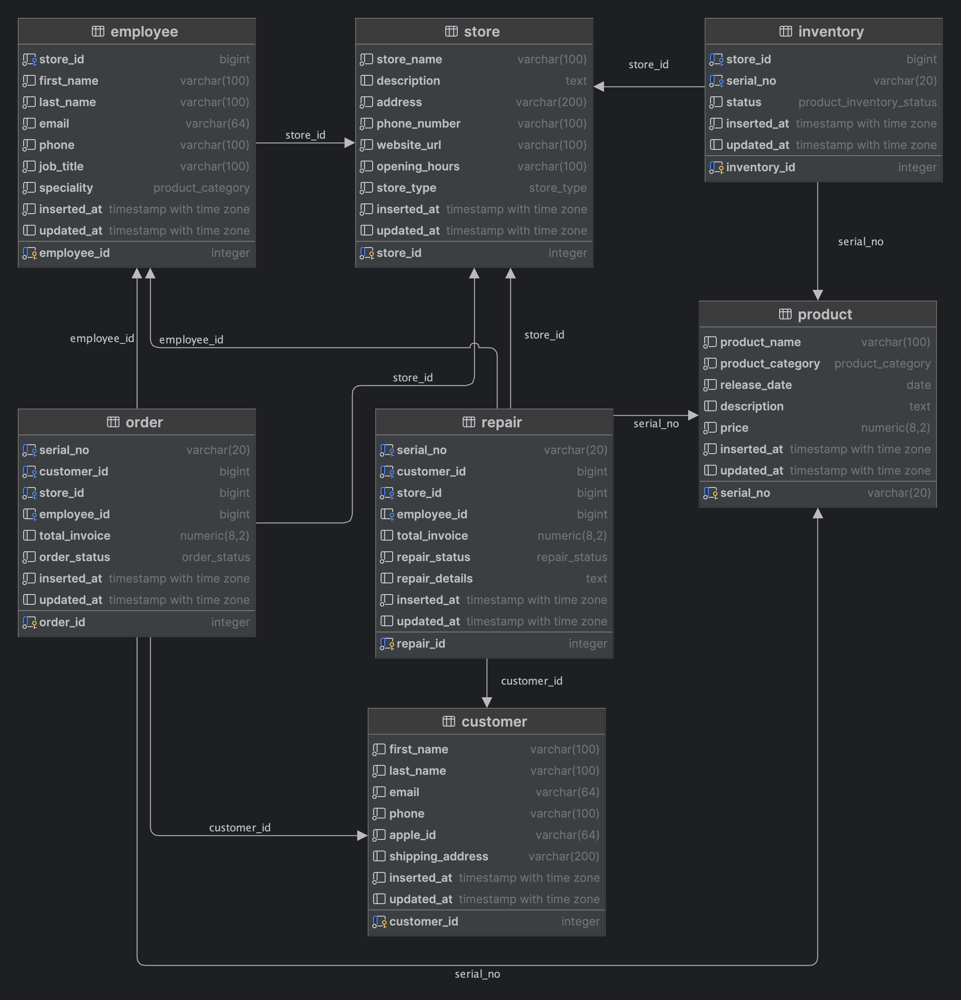
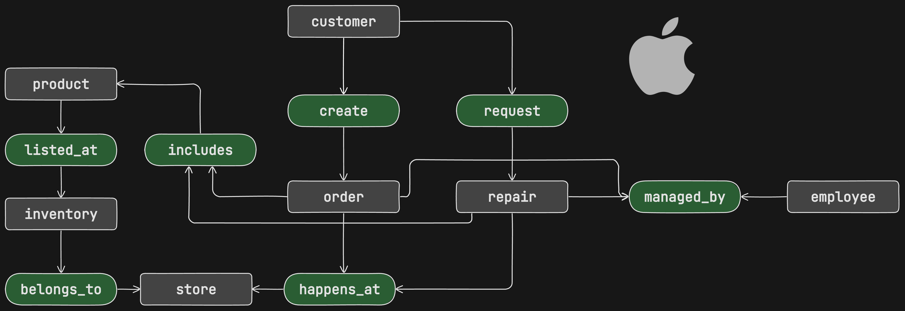
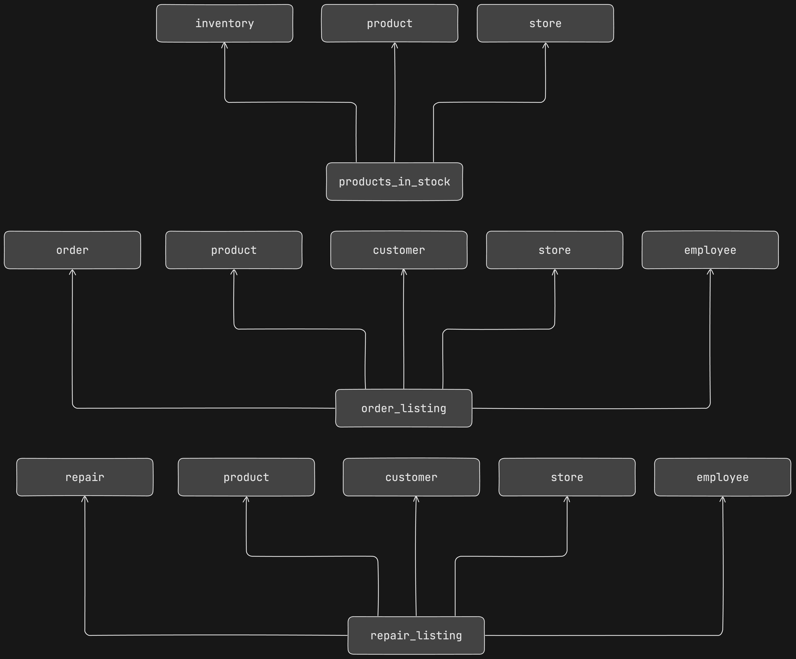

# Design Document

By Kamoliddin Nabijonov  
GitHub: Kamoliddin-Nabijonov  
edX: k-nabijonov  
Tashkent, Uzbekistan

Video overview: https://drive.google.com/file/d/1La9tsY4dJXB_XPvR-_Vx0IqSybRXC_Jw/view?usp=sharing

## Scope

I have decided to design a database than can support core business operations of Apple Store. The category of database if retail meaning that operations are performed by users on products. The goal was to include the core entities of business. In our case we have customers, employees, stores, and products that are involved in business process and which correspond to real world entites. We additionally have to create additional tables to track orders, repairs and products in inventory. 

There are in total 7 tables:  
**Main entities (objects):** customer, employee, store, product  
**Main entities (operations):** order, repair, inventory

There more entities that should be added to the database to make it complete. For exaple, a table to track billing and invoices, product categories, discounts, and shipping data. To keep the project simple, I have decided not to add them in my database and keep only the entities required to complete main activities during one's visit to Apple store.


## Functional Requirements

An set of applications can be implemented on top of this database with separate interfaces for users to perform actions and employees to manage and interact with transactions.  

Users should be able to place orders which are then processed by store employees, cancel only uncompleted (not paid for and not closed by employee) orders. They also can place a request to repair a device. 

Employees should be able to update inventory, manage orders (consult, complete and edit), and complete orders. In terms of repair services, employees are fully responsible for the process. They move repair requests to in progress when the work is started, with repair details inlcuding desciption and the total cost filled and status updated. The repair can be closed by employee only upon completion and invoice being paid by the customer. 

I have implemented stored procedures to perform actions like creating, canceling, managing orders, submitting repair request, processing repair, and completing it. Inventory is also filled by stored procedure that accepts arguments and which can be used by store employees. Trigger on order table is used to automatically unlist the item when it was purchased. 

**add_inventory_item** -> used to fill inventory with new products.  
**create_order** -> validate if product is available and create order using serial number, customer id, store id.   
**process_order** -> assign the order to employee, set total cost, change status to completed, and unlist the item using the trigger.  
**cancel_order** -> cancel uncompleted only order.  
**request_repair** -> place a request to repair the product using serial number, customer id, store id.  
**process_repair** -> assign the repair to employee, set total repair cost, change status to “in progress”.  
**complete_repair** -> complete the repair.  


Employees should also have access to views that were implemented for general internal use and analysis. Users should not be able to access views and procedures that are for employee use only. Separate users and permissions can be establish to ensure this requirement. I have ommited this step not to overcomplicate the project.


## Representation



### Entities

**NAME:** Store  
**TYPE:** ```table```  
**DESCRIPTION:** Store object keep data on all availabe stores in database. An enum called store_type keeps information on availabe store types.
Store must have store_id which is a primary key of table, the name of store, description, address, phone_number, website_url for user to navigate into, opening_hours for users to know when to visit the store, store_type defined by enum.
Additionally, inserted_at and updated_at columns were defined to keep a track when the record was inserted into the table and when it was last updated.

```
CREATE TYPE store_type AS ENUM (
    'Apple Store',
    'Apple Authorized Reseller',
    'Online'
);

CREATE TABLE store (
    store_id SERIAL PRIMARY KEY,
    store_name VARCHAR(100) NOT NULL,
    description TEXT,
    address VARCHAR(200) NOT NULL,
    phone_number VARCHAR(100) NOT NULL,
    website_url VARCHAR(100) NOT NULL,
    opening_hours VARCHAR(100) NOT NULL,
    store_type store_type NOT NULL,
    inserted_at TIMESTAMPTZ NOT NULL DEFAULT NOW(),
    updated_at TIMESTAMPTZ
);
```

**NAME:** Product  
**TYPE:** ```table```  
**DESCRIPTION:** Product object keep data on all availabe products in database. An enum called product_category keeps information on availabe product types.
Products are all items that could be acquired by the customer such as: Mac, iPhone, cases, and so on. We need to keep data on products name, category, when the product was released, and its price and short description. I have decided to use Numeric type for price field to have an exact precision of a floating point number. serial_no field is of varchar to store the real unique code of the item which is a combination of letters and numbers. This fields acts as a natural key for the entity because Apple assigns such unqie code to each item it produces.

```
CREATE TYPE product_category AS ENUM (
    'iPhone',
    'iPad',
    'Mac'
);

CREATE TABLE product (
    serial_no VARCHAR(20) PRIMARY KEY,
    product_name VARCHAR(100) NOT NULL,
    product_category product_category NOT NULL,
    release_date DATE NOT NULL,
    description TEXT,
    price NUMERIC(8,2) NOT NULL,
    inserted_at TIMESTAMPTZ NOT NULL DEFAULT NOW(),
    updated_at TIMESTAMPTZ
);
```

**NAME:** Inventory  
**TYPE:** ```table```  
**DESCRIPTION:** Inventory table keeps track of which products are availabe for purchase at a given store. Product in inventory might either be availabe indicating that the customer can buy it and unailable for purchase. The required fields are: inventory id (primary key generated by database), store id (to which the given inventory belongs), serial number of the product, and the current status of the listing.

Note that there can be only one listing of the product for each store. We cannot have 2 exacly same products listed twice in the store.

```
CREATE TYPE product_inventory_status AS ENUM (
    'available',
    'unavailable'
);

CREATE TABLE inventory (
  inventory_id SERIAL PRIMARY KEY,
  store_id BIGINT NOT NULL,
  serial_no VARCHAR(20) NOT NULL,
  status product_inventory_status NOT NULL DEFAULT 'available',
  inserted_at TIMESTAMPTZ NOT NULL DEFAULT NOW(),
  updated_at TIMESTAMPTZ,
  FOREIGN KEY (store_id) REFERENCES store(store_id) ON DELETE RESTRICT,
  FOREIGN KEY (serial_no) REFERENCES product(serial_no) ON DELETE RESTRICT,
  CONSTRAINT unique_inventory_product UNIQUE (store_id, serial_no)
);
```


**NAME:** Employee  
**TYPE:** ```table```  
**DESCRIPTION:** This table keeps all employee data. The fields requied are first name, last name, store id where the employee works, contact details, job title and speciality. Note that we used the same enum as in products table due to the fact that each employee at Apple store has defined speciality (product) in which they are experts at. 

```
CREATE TABLE employee (
  employee_id SERIAL PRIMARY KEY,
  store_id BIGINT NOT NULL,
  first_name VARCHAR(100) NOT NULL,
  last_name VARCHAR(100) NOT NULL,
  email VARCHAR(64) NOT NULL,
  phone VARCHAR(100) NOT NULL,
  job_title VARCHAR(100) NOT NULL,
  speciality product_category NOT NULL,
  inserted_at TIMESTAMPTZ NOT NULL DEFAULT NOW(),
  updated_at TIMESTAMPTZ,
  FOREIGN KEY (store_id) REFERENCES store(store_id) ON DELETE RESTRICT
);
```

**NAME:** Customer  
**TYPE:** ```table```  
**DESCRIPTION:** This table keeps only required customer data to perform transactions. The fields requied are first name, last name, contact details, and apple_id used by apple to map orders and repairs to exact customer. We also need to keep shipping address.

```
CREATE TABLE customer (
  customer_id SERIAL PRIMARY KEY,
  first_name VARCHAR(100) NOT NULL,
  last_name VARCHAR(100) NOT NULL,
  email VARCHAR(64) NOT NULL,
  phone VARCHAR(100) NOT NULL,
  apple_id VARCHAR(64) NOT NULL,
  shipping_address VARCHAR(200),
  inserted_at TIMESTAMPTZ NOT NULL DEFAULT NOW(),
  updated_at TIMESTAMPTZ
);
```


**NAME:** Order  
**TYPE:** ```table```  
**DESCRIPTION:** This table keeps all orders happening across all shops. We have specified an order_status enum to specify the status of each order.
It is a many to many table to track all transactions. We need to know which product (serial_no) was acquired by which customer and at which store. Additionally, as menitoned above, each order must be processed by an employee to help the customer and complete the order successfully. We also store the amount of money paid for each order and it's final status.

There is an unique constraint to ensure that we have only a single order for given serial_no, customer and store. You cannot buy the product multiple times. 

```
CREATE TYPE order_status AS ENUM (
    'created',
    'completed',
    'canceled'
);

CREATE TABLE "order" (
  order_id SERIAL PRIMARY KEY,
  serial_no VARCHAR(20) NOT NULL,
  customer_id BIGINT NOT NULL,
  store_id BIGINT NOT NULL,
  employee_id BIGINT,
  total_invoice NUMERIC(8,2),
  order_status order_status NOT NULL DEFAULT 'created',
  inserted_at TIMESTAMPTZ NOT NULL DEFAULT NOW(),
  updated_at TIMESTAMPTZ,
  FOREIGN KEY (serial_no) REFERENCES product(serial_no) ON DELETE RESTRICT,
  FOREIGN KEY (customer_id) REFERENCES customer(customer_id) ON DELETE RESTRICT,
  FOREIGN KEY (store_id) REFERENCES store(store_id) ON DELETE RESTRICT,
  FOREIGN KEY (employee_id) REFERENCES employee(employee_id) ON DELETE RESTRICT,
  CONSTRAINT unique_order UNIQUE (serial_no, customer_id, store_id)
);
```

**NAME:** Repair  
**TYPE:** ```table```  
**DESCRIPTION:** This table keeps all repairs happening across all shops. We have specified an repair_status enum to specify the status of each repair. It is a many to many table to track all repairs. We need to know which product (serial_no) was submitted for repair by which customer and at which store. Additionally, as menitoned above, each repair must be processed by an engineering employee to help the customer and complete the repair successfully. We also store the amount of money paid for each repair and it's final status. The repair can be initiated, in progress and finally completed.

```
CREATE TYPE repair_status AS ENUM (
    'initiated',
    'in progress',
    'completed'
);

CREATE TABLE repair (
  repair_id SERIAL PRIMARY KEY,
  serial_no VARCHAR(20) NOT NULL,
  customer_id BIGINT NOT NULL,
  store_id BIGINT NOT NULL,
  employee_id BIGINT,
  total_invoice NUMERIC(8,2),
  repair_status repair_status NOT NULL DEFAULT 'initiated',
  repair_details TEXT,
  inserted_at TIMESTAMPTZ NOT NULL DEFAULT NOW(),
  updated_at TIMESTAMPTZ,
  FOREIGN KEY (serial_no) REFERENCES product(serial_no) ON DELETE RESTRICT,
  FOREIGN KEY (customer_id) REFERENCES customer(customer_id) ON DELETE RESTRICT,
  FOREIGN KEY (store_id) REFERENCES store(store_id) ON DELETE RESTRICT,
  FOREIGN KEY (employee_id) REFERENCES employee(employee_id) ON DELETE RESTRICT
);
```

### Relationships



Customer when comes to store or online can order a product and submit repair request. Both order and repair are controlled and performed by store employees. Each order and repair happends in the store which has inventory with the listings of available products for purchase and the ones that were already bought. Note that we also have to include product serial_no in our orders and repairs tables to map each transaction to particular product.

**store -> product (through inventory):** A many-to-many relationship. A store can have multiple products, and a product can be in the inventory of multiple stores. The inventory table acts as a junction table.  
**store -> employee:** A one-to-many relationship. A store can have many employees, and an employee works at one store.  
**customer -> order:** A one-to-many relationship. A customer can have multiple orders, and an order belongs to one customer.  
**order -> product:** A many-to-many relationship (most likely). An order can contain multiple products, and a product can be contained within multiple orders. This would require an additional junction table (not currently defined).  
**repair -> product:** A one-to-many relationship. A repair is for a specific product, and a product could have multiple repairs over time.  
**store -> order:** A one-to-many relationship. An order is placed at a specific store, and a store can have multiple orders.  
**employee -> order:** A one-to-many (loose) relationship. An employee might serve a customer with an order, but it's not mandatory.  
**store -> repair:** A one-to-many relationship. A repair is performed at a specific store, and a store can perform multiple repairs.  
**employee -> repair:** A one-to-many (loose) relationship. An employee might perform a product repair, but it's not mandatory.  


## Optimizations

It is common practise to use denormalized representation of a database for data analysis and general use to avoid writing big join sql queries. To impement such functionality, I have created 3 views: 

**products_in_stock** -> display all products available for purchase.   
**order_listing** -> all orders with all data from related tables brought together.  
**repair_listing** -> all repairs with all data from related tables brought together.  



Additionally, two of the UNIQUE constrains I have specified on inventory and orders, will create a special type of unique index to ensure the constaint and making the search much faster.


## Limitations

Core entities required for operations are implemented. However there are many more that are required to complete the database. Below are current issues and limitations we have:

**ENUM Data Types:** ENUM types are convenient but changes (adding/removing values) can be tricky, requiring database migrations to change values within existing tables.    
**Normalization:** The product_category can be normalized into its own table to reduce redundancy.  
**Optional vs. Mandatory:** In some tables, there's ambiguity in whether certain fields should be mandatory. For example, should an employee always be associated with an order or repair?  
**Order/Product relationship:** We'll likely need a junction table to properly model the many-to-many relationship between orders and products. This table would store details on quantity ordered per product within an order.  
**Missing shipping data:** It might be helpful to add a shipping table and link it to the orders table.
**Incorrent procedures:** The logic in the procedures I have implemented are too simple. I have to add more validation steps before performing the actions.
